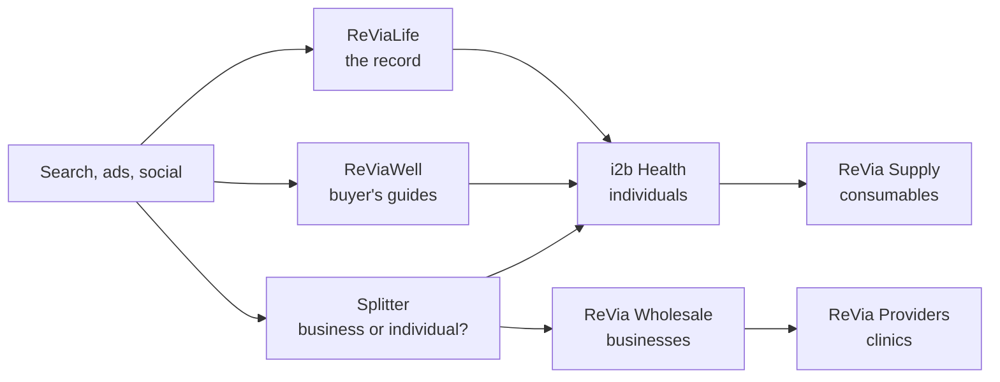

# ReVia Life — Brand Context & Site Copy

2026-09-18 · @Someone

## Read me first

Every item on the writing list is answered below, from the FDA record, Mike's emails, the September 15 call, the COA on file and the pages already published. Three decisions are made here rather than deferred: the sourcing sentence does not run, Mike is the public face, and /learn keeps its own job. One correction runs through all of it: Mike never testified to Congress. He spoke five times at the FDA's Pharmacy Compounding Advisory Committee at White Oak in Silver Spring, Maryland, on July 23–24, 2026. Every "Congress" and "congressional" on the site becomes "FDA".

| # | Item | The answer |
| --- | --- | --- |
| 1 | Homepage | The positioning paragraph and hero copy are in §1. The site sells nothing, so it carries the record and the standard, and "Real Results" is gone. |
| 2 | Mike Stone | Bio drafted in §2. He is the face of the brand; /about is his story and no /about/mike-stone is needed. No other speeches exist: /washington is complete. No photograph on file; interim source given. |
| 3 | About | Four blocks in §3: why ReVia exists, who runs it, the standard, how the site is paid for. |
| 4 | Sourcing claim | Do not publish it (§4). The certificate on file was issued in New Hampshire, the 503(b) claim is absent from FDA's own list, and the origin line has no document behind it. |
| 5 | Why Us | Rewritten in §5 to what the Chromate certificate actually reports, with the certificate linked. |
| 6 | Ecosystem | Seven properties, one line each, in §6. |
| 7 | News | Ten posts with sources and a stated position in §7. |
| 8 | Learn vs reviawell | Keep both. /learn becomes the library; reviawell keeps the buyer's guides (§8). |

**Site-wide corrections before anything ships.** The docket is FDA-2025-N-6895, not FDA-2026-N-2979. Mike delivered five statements, not seven. He is "Mike Stone, Founder, ReVia" on every page; the docket comment is signed Michael Stone, Owner, Revia LLC, Fort Myers, and reviawell's "Miami" is wrong. Do not print a founding year: the site says 2024, the intake form says 2025, and Sunbiz shows the active REVIA LLC (L26000158453) as a 2026 filing beside an inactive 2025 one. Every manufacturing and regulatory sentence goes to Anthony before publication, as the dossier already required.

The legislative stance, the op-eds and the regulation posts are on the second tab: [Regulation and advocacy](file/628c3e23-de31)

## 1. Homepage — what ReVia stands for

ReVia is the standard its founder built for himself. Build the page around this paragraph; every line of it traces to Mike's own words on the FDA record.

**The positioning paragraph.** ReVia started because Mike Stone got sick, was told by his doctors to go and explore peptides, and found a market that could not tell him what was in the vial. So he set the standard he wanted for his own family: every lot finished and tested in the United States, a certificate for that lot that anyone can verify, and nothing said on a page that the paperwork cannot back up. In July 2026 he carried that argument to the FDA's compounding advisory committee, five times over two days, and said what suppliers do not usually say out loud: his market is gray, he is in it, and the way out runs through a licensed physician and a US manufacturer. This site is that record. It sells nothing.

**Hero.**

- Eyebrow: *ReVia · Fort Myers, Florida*
- Headline: *Know exactly what it is.*
- Subhead: *After a diagnosis, a gray market and a vial that made him sick, Mike Stone built the supplier he wanted for his own family. Every lot finished and tested in the United States. A certificate you can verify at the lab. A founder who said all of it to the FDA, on the record.*
- Buttons: *Read the five statements* (/washington) · *See how a lot is tested* (/why-us)

**Four proof bands, in this order.**

1. *Finished and tested in the United States.* Every lot goes to an independent US laboratory before it ships.
2. *One certificate per lot.* Identity, quantity, purity and heavy metals on one page, with a code that returns the same certificate from the lab.
3. *On the record at the FDA.* Five statements at White Oak, July 23–24, 2026, with the FDA's own webcast and the full transcripts.
4. *One standard under every property.* The same lots and the same certificates sit under i2b Health, ReVia Wholesale and ReVia Providers.

**The tagline.** "Know More." is Mike's own principle, in his Aug 26 email and on reviawell. Use it as the closing line of the page and nowhere else.

**Off the page.** "Real Results" (an outcome claim on a site that sells nothing). ">99% purity, every batch" and "99.4% avg purity" (the certificate on file reports 98.03% against a >98% limit, §5). "12 QC tests per batch", "LC-MS verified", "cGMP certified", "ISO" and "503(b)" (no document supports them, §4). "Congress" in any form. Any category word that names a use.

Sources: Day 1 statement at 52:39–56:48 and Day 2 at 1:17:10 (the [transcripts](https://docs.google.com/document/d/1Ufxmv56Y70G7yrRVT_3d4PjbGAKwpxp8V6zTNZGFfQY/edit)); Mike's [Aug 26 email](https://mail.google.com/mail/u/0/#all/1a03e805b3d4429a) ("The principle underneath all of this is still the same: Know More."); the [March 2026 certificate](https://drive.google.com/file/d/1gL7wEK3vblol4dxRXqTRUX2xRkHEQwEh/view).

## 2. Mike Stone

Mike is the public face of ReVia, and /about is his story. Charlie runs i2b and belongs on i2b's About page, which the family wants kept about i2b. The bio below is written to publish; the byline is *Mike Stone, Founder, ReVia*.

**Who he is.** Mike Stone spent more than thirty years in business development, corporate finance, biotechnology, medtech, pharma and real estate, from startup to growth stage, including companies that sat between pharmaceutical and consumer markets. He was an entrepreneur and an Ironman triathlete. In 2019 he was diagnosed with a degenerative neurological disease. Conventional medicine did not work. He went from 180 pounds to 125 and was bedridden.

**Why he was in the room.** Physicians at one of the country's leading institutions suggested he explore peptides, and he did it the way everyone does: Reddit, podcasts, strangers who knew a guy. He bought overseas and got scammed. One vial of TB-500 gave him hot flashes, nausea and welts at the injection site; the same compound from another vendor did nothing of the kind. That taught him that every supplier is different and a good review proves nothing. He decided that if he was going to put something in his body, he would know exactly what it was, and the same for his family. He found a US-based manufacturer he could visit, walk through and shake hands with, and started ReVia in Fort Myers, Florida. When FDA took seven peptides to its Pharmacy Compounding Advisory Committee on July 23–24, 2026, he filed a written comment to the docket as owner of ReVia LLC, registered for the open public hearing, and spoke five times from the podium at White Oak. He told the committee his market was gray, that he was in it, and that he wanted it regulated. The committee recommended six of the seven.

**Since then.** He split the business in two: a professional and wholesale side under ReVia, and a consumer research brand, i2b Health, run by his son Charlie. The wholesale and practitioner ordering portal went live in September 2026 with 5DGenX and Sereno GPO as the first accounts. The education stayed free.

**The five statements.** There are no others. The "congressional speeches" in the September 15 notes are these; Edward's line about listening "over the 3-day period" described his weekend, and Mike confirmed he went off script. The captions show no appearance in the MOTS-c or Epitalon sessions, and he told the TB-500 session it would be the last time they saw him that day. He was slated for seven slots and used five. /washington is complete once each statement carries its webcast link and start time.

| Day | Substance | Slot | Webcast time | Vote |
| --- | --- | --- | --- | --- |
| Jul 23 | BPC-157 | Speaker 2, 5 min | [52:39–56:48](https://youtube.com/live/DhDC0DAYdBI) | 8–6–1, recommended |
| Jul 23 | KPV | Speaker 1, 3 min | 5:17:10–5:20:35 | 8–6–1, recommended |
| Jul 23 | TB-500 | Speaker 2, 3 min | 8:21:42–8:24:12 | 8–6–1, recommended |
| Jul 24 | Emideltide (DSIP) | Speaker 2, 4 min | [1:17:10–1:19:26](https://youtube.com/live/xXM5ecHxlMU) | 6–7–1, not recommended |
| Jul 24 | Semax | Speaker 1, 4 min | 6:12:03–6:15:05 | 8–5–1, recommended |

A transcript circulating that runs 52:47–1:02:33 and has him describing "products that come back to us" is spliced from two sessions and adds sentences he did not say; do not use it. FDA had posted no official transcript as of September 18; the dossier's transcripts are cleaned auto-captions and the quotes should be rechecked when FDA's version appears.

**Photograph.** None on file. Drive holds no portrait of Mike (searched September 18), and the only footage of him is the three short Instagram ads he ran in May. Ask him for one portrait and one working photograph; the manufacturer visit he describes on the record would be the picture. Until then, a still from the FDA's Day 1 webcast at 52:39 shows him at the podium and can run with his say-so.

Sources: the [transcripts](https://docs.google.com/document/d/1Ufxmv56Y70G7yrRVT_3d4PjbGAKwpxp8V6zTNZGFfQY/edit) and the [Story Source Dossier](https://docs.google.com/document/d/1GYSOQwmusZ6IVQR8ZMz4TPohgY4vjMVVWn2AxzlLaHQ/edit) §§3, 5, 7; [reviawell.com/about](https://reviawell.com/about) (career, 2019 diagnosis); the [FDA meeting page](https://www.fda.gov/advisory-committees/advisory-committee-calendar/july-23-24-2026-meeting-pharmacy-compounding-advisory-committee-07232026); [The Epoch Times, July 23, 2026](https://www.theepochtimes.com/health/fda-committee-recommends-4-peptides-to-drug-compounding-list-6066651); Mike's emails of [June 22](https://mail.google.com/mail/u/0/#all/19ef1589ed19d78c) ("I have been invited to testify infront of the FDA on July 23 and 24"), [July 10](https://mail.google.com/mail/u/0/#all/19f4d7b314f5110c) ("7 sessions slated"), [Aug 26](https://mail.google.com/mail/u/0/#all/1a03e805b3d4429a) (the split) and [Sept 10](https://mail.google.com/mail/u/0/#all/1a08dab4aea5627b) ("the i2b spin out"); the [Sept 15 call notes](https://docs.google.com/document/d/1qxQXaMtJr3Lo3EOeuN_L6A_-wCQkUIcgDsoCKL5TixQ/edit) at 00:02:24–00:04:04.

## 3. About

Four blocks replace the filler: why ReVia exists, who runs it, the standard, and how the site is paid for. Charlie's brief for the family's other About page applies here too: condense, lead with what the record shows, and cut anything that reads as written by a machine. The copy below is meant to publish as written, under the byline *Mike Stone, Founder, ReVia*.

**Why ReVia exists.** ReVia exists because Mike Stone needed a supplier he could trust and could not find one. After a 2019 diagnosis and a wasting that took him from 180 pounds to 125, his doctors suggested he explore peptides. The market he found sold fakes, underdosed vials and certificates that were decoration. One vial made him sick; the same compound from another vendor did not. So he set a standard for what he would put in his own body and his family's, found a US manufacturer he could walk into, and began supplying it to others. In July 2026 he said all of this to the FDA's Pharmacy Compounding Advisory Committee, on the record, five times.

**Who runs it.** ReVia is a family business in Fort Myers, Florida. Mike Stone founded it and runs the professional and wholesale side. His son Charlie Stone runs i2b Health, the research brand that supplies individual researchers. It is a family business, and the founder's name is on the FDA docket.

**The standard.** Every lot we supply is finished and tested in the United States. An independent laboratory tests each lot and issues a certificate that names the lot, the tests, the limits and the results, with a code that verifies it at the lab. If a lot fails, it does not ship. Nothing on this site describes a human use, a dose or a result, because these are research materials and we only publish what the paperwork supports.

**How this site is paid for.** ReViaLife is published by ReVia LLC, which also supplies the compounds sold by i2b Health and through ReVia Wholesale. We tell you that because a resource that hides its funding is not a resource. This site sells nothing, takes no commission, and holds every ReVia property to the standard printed above.

**Notes for the build.** Do not print a founding year (see the corrections in the summary). Name Charlie only with Mike's approval; Max is mentioned on the September 15 call as Charlie's brother and appears nowhere public, so leave him out. Where the page shows figures (lots on record, certificates published), pull them live from the certificate archive rather than typing them; the i2b page's "10 batches on record" is a hand-typed number and will drift. The funding paragraph is the conversion plan's disclosure requirement and goes above the fold.

Sources: Day 1 statement at 52:39 and Day 2 at 1:17:10 ([transcripts](https://docs.google.com/document/d/1Ufxmv56Y70G7yrRVT_3d4PjbGAKwpxp8V6zTNZGFfQY/edit)); [reviawell.com/about](https://reviawell.com/about); the [intake form](https://drive.google.com/file/d/1Wkf9kDK1S0hLERvR36loEbkjt4H3e8nU/view) (Charlie Stone, Manager; catalog sourced from Lance's supply chain); Mike's [Aug 26 email](https://mail.google.com/mail/u/0/#all/1a03e805b3d4429a) (Charlie spearheads the consumer brand); the [Sept 15 call](https://docs.google.com/document/d/1qxQXaMtJr3Lo3EOeuN_L6A_-wCQkUIcgDsoCKL5TixQ/edit) at 00:52:23–01:01:37 ("family-run business", condense, prioritize the record); the [Conversion Plan](https://docs.google.com/document/d/1T8zDFx8r0I5en9p0pudvVSTaB-zmYsaFE1TERR24jjQ/edit) §3 (the disclosure).

## 4. The sourcing claim

Do not publish the sentence, on either site. "Active pharmaceutical ingredient is sourced from Germany and Ukraine, then finished and tested in Florida" fails on the facts before it reaches the compliance question: the only certificate on file was issued in New Hampshire, the origin line has no document behind it, and the 503(b) claim that travels with it is absent from FDA's own register. The i2b checker is right to ban it, and revialife should ban the same string, from the same list.

| Claim as published | What the files actually show | Verdict |
| --- | --- | --- |
| "Finished and tested in Florida" | The supply chain runs through Lance Liberti's Integrative Practice Solutions / AgeREcode in Tampa, so "finished in Florida" is plausible. The [certificate on file](https://drive.google.com/file/d/1gL7wEK3vblol4dxRXqTRUX2xRkHEQwEh/view) (COA #33593, Sermorelin, March 2026) was issued by Chromate, which markets itself from Hudson, New Hampshire. Testing happened in New Hampshire. | Half wrong. "Processed and tested in the United States" is true; "tested in Florida" is contradicted by the certificate. |
| "API sourced from Germany and Ukraine, never China or India" | Appears only on Mike's own pages (reviawell About, the vetting guide) and in copy derived from them. No supplier certificate, import record or manufacturer document anywhere in Drive or email names a country. Mike, Aug 26: the telehealth buyer "aren't so concerned about country of origin as they are quality and verifiable COAs." | Unsubstantiated. Off every page until a document exists. |
| "Florida 503(b) outsourcing facility, FDA-registered, cGMP and ISO certified" | FDA's [registered outsourcing facility list](https://www.fda.gov/drugs/human-drug-compounding/registered-outsourcing-facilities) (updated Sept 8, 2026) shows 13 Florida facilities. None is IPS, AgeREcode, Juventix or ReVia. The docket comment repeats the claim ("US-registered 503(b) contract manufacturer"). | Unsupported. Retire "503(b)", "cGMP certified" and "ISO" until the registration is in hand. |
| "Independent FDA-registered laboratory" | [chromate.org](https://chromate.org/) lists no accreditation or registration. [Watchtower's review](https://www.watchtowerpeptides.com/labs/chromate) finds no ISO/IEC 17025, no A2LA listing, an LLC formed October 2025 and an owner not in good standing in New Hampshire. | Do not call the lab registered or accredited. Name it, link the verify portal, and let the certificate speak. |
| "MADE IN USA" on the i2b label | An unqualified Made in USA claim requires "all or virtually all" domestic content under the FTC's rule, [16 CFR Part 323](https://www.ecfr.gov/current/title-16/chapter-I/subchapter-C/part-323). Imported API fails that test if the origin line is true. | Qualify it on the next label run: "Finished and tested in the USA". |

**Why the checker is right even if the sentence were true.** A page on a research-materials site that narrates a drug's manufacture, from active pharmaceutical ingredient to finished product, describes a pharmaceutical supply chain. FDA reads intended use from "the circumstances surrounding the distribution of the article" ([21 CFR 201.128](https://www.ecfr.gov/current/title-21/chapter-I/subchapter-C/part-201/subpart-D/section-201.128)), and its 2026 warning letters to research-use sellers are built from website copy. The sentence buys nothing a certificate cannot buy better.

**What runs instead.** "Every lot we supply is finished and tested in the United States. The laboratory that tests it, the method it uses and the results it found are printed on the certificate for that lot, with a code that verifies it at the lab." That sentence is true today and stays true when the origin line is documented.

**How the line comes back.** One document, held by Anthony: the manufacturer's own certificate or supplier declaration naming the API maker and its country, for the lots on sale. When it exists, the same sentence goes on every property at once, the checker's banned-string list is updated in the one place all four repos read it from, and the i2b label gets its qualified claim. Same supply chain, one rule.

Sources: the [intake form](https://drive.google.com/file/d/1Wkf9kDK1S0hLERvR36loEbkjt4H3e8nU/view) ("ReVia's full product catalog is sourced from Lance's supply chain"); [IPS on RocketReach](https://rocketreach.co/integrative-practice-solutions-inc-profile_b589d636f9f6271d) (Tampa, Florida); Mike's [Sept 9 COA request to Lance](https://mail.google.com/mail/u/0/#all/1a0a6b9084b04ef7) and the [5DGenX label thread](https://mail.google.com/mail/u/0/#all/1a08d90882187bf5) (orders@integrativepracticesolutions.com); [reviawell.com/about](https://reviawell.com/about) and [reviawell.com/vetsuppliers](https://reviawell.com/vetsuppliers); Mike's [Aug 26 "New opp" email](https://mail.google.com/mail/u/0/#all/1a03fc8156e77e8a); the docket comment in the [Story Source Dossier](https://docs.google.com/document/d/1GYSOQwmusZ6IVQR8ZMz4TPohgY4vjMVVWn2AxzlLaHQ/edit) §6.6; the [Evidence Dossier](https://docs.google.com/document/d/18jJJSu2lpCERt-lwzMF40B_U3C8XRnutBvWFE1sw4o4/edit) §4.5.

## 5. Why Us — the testing story the certificate supports

The positive case is the certificate itself: one page per lot, from a named laboratory, with a code that returns it from the lab. Write the page to that document and link it, and the page is stronger than any superlative it replaces.

**Page copy.**

*Every lot is tested. Here is the certificate.* Each lot we supply goes to an independent laboratory in the United States before it ships. The laboratory reports four things on one page: identity, whether the material is the named peptide; quantity, the milligrams found against the label; purity, the share of the material that is the named peptide, measured by reversed-phase HPLC with UV detection; and heavy metals, against a limit of 50 parts per billion. The certificate carries the lot code, the date the sample arrived, the date it was run, the chromatogram, the chemist's name and an access code. Type the code into the laboratory's verify page and the same certificate comes back from the laboratory's own database.

*What we will tell you.* If a lot fails, it does not ship. If a method changes, the next certificate says so. If a certificate and a vial disagree, we investigate and write back. These are research materials for laboratory use; nothing here describes a human use.

**The certificate, line by line** (COA #33593, Sermorelin 10 mg, Chromate, sample received March 27, 2026, analyzed March 28):

| Line on the certificate | What it says on this lot |
| --- | --- |
| Laboratory | Chromate, verify portal at chromate.org/verify |
| Product and lot code | Sermorelin 10 mg, RECODE4X3KZ3 |
| Method | Qualitative and quantitative analysis by RP-HPLC with UV detection (220 nm) |
| Identity | Sermorelin, conforms |
| Quantity | 11.36 mg found against 10 mg labelled (+13.6%), conforms |
| Purity | 98.028% against a >98% specification, conforms |
| Metals | <50 ppb against a <50 ppb limit, conforms |
| Signed | Lucas Weber, Principal Chemist; produced March 29, 2026 |

**Claims to retire, and why.** ">99% purity, every batch" and "99.4% average": this certificate shows 98.03% against a >98% limit, so the line is false on the archive's own evidence; quote the limit printed on each certificate instead. "LC-MS identity after reconstitution", "sterility and endotoxin", "ICP-MS", "12 QC tests": none appears on the certificate on file; publish those certificates if the lab runs them, and drop the words until it does. "No other peptide company does this" and "highest bar": unsubstantiated comparatives, already removed. "Independent FDA-registered laboratory": see §4.

**The comparison chart Charlie asked for.** Build it as questions a reader can check on any supplier's site, with a check for ReVia and the reader's answer for the other column. No competitor is named and no row asserts what others fail to do. Rows: a certificate for this lot, linked from the product page; a verification code that returns the certificate from the laboratory; the laboratory named on the certificate; identity, quantity, purity and metals reported with limits and results; a chemist's signature and test dates; finished and tested in the United States; the supplier's name on the docket of the July 2026 FDA hearing.

**Branding on the certificates.** The certificate on file is AgeREcode-branded, the manufacturer's label. Mike requested i2b LLC-branded certificates from Lance on September 9 for eleven products and chased on September 15. ReVia's archive should show ReVia- or i2b-branded certificates, or one sentence explaining that the manufacturer's name appears on them, which Mike accepted at intake.

Sources: the [certificate](https://drive.google.com/file/d/1gL7wEK3vblol4dxRXqTRUX2xRkHEQwEh/view) Edward sent Mike on [Sept 11](https://mail.google.com/mail/u/0/#all/1a0913186e438da8); the [April 15 Chromate archive](https://mail.google.com/mail/u/0/#all/19d8e73f64ac420e) ("2026 (Chromate).zip"); the [Sept 9 COA request](https://mail.google.com/mail/u/0/#all/1a0a6b9084b04ef7); the [Sept 15 call](https://docs.google.com/document/d/1qxQXaMtJr3Lo3EOeuN_L6A_-wCQkUIcgDsoCKL5TixQ/edit) at 00:48:45–00:58:25 (the chart, Chromate, "other foreign supplier companies"); the current [revialife.com/why-us](https://revialife.com/why-us) and [homepage](https://revialife.com/) claims; the [Partner Pages Copy Pack](https://docs.google.com/document/d/1pDHsd9v47QBYMuiwIkS30JcwXNj26OMmMkMd-XrKwwM/edit) page 5 and Appendix B; ICH Q7 §11.4 on certificate contents via the [Evidence Dossier](https://docs.google.com/document/d/18jJJSu2lpCERt-lwzMF40B_U3C8XRnutBvWFE1sw4o4/edit) §3.6.

## 6. The ecosystem — one line per property

Seven properties, one catalogue, one rule: only one of them sells to an individual. These lines are written to go on the network map as they stand.

| Property | Who it is for | Why it exists |
| --- | --- | --- |
| **ReViaLife** (revialife.com) | Everyone, before they buy | The record and the standard: Mike's five FDA statements, the regulation explainers, the compound library. Sells nothing, takes no commission. |
| **i2b Health** (i2bhealth.com) | Individual researchers | The only ReVia property that sells single units. Charlie Stone runs it; a certificate sits on every product page; the banner reads Professional Use Only. |
| **ReVia Wholesale** (reviawholesale.com) | Businesses and brands | Bulk, private label and a partner API with webhooks. Every order stops at Mike for approval before it goes to fulfilment. Live since September 2026 with 5DGenX and Sereno GPO. |
| **ReVia Providers** | Clinics and prescribers | Qualified accounts with professional pricing behind a login. Mike's September 17 plan: a referral code from a professional opens the price list; the same checkout and fulfilment as the store. |
| **ReVia Cosmetics** | Consumers | The four ReVia-branded skincare products, sold direct. The one consumer line that carries no research designation. |
| **ReVia Supply** (the i2b supply site) | Anyone reconstituting | Syringes, bacteriostatic water and acetic acid on a separate site on purpose: FDA reads peptides sold beside syringes as intended for human use. |
| **ReViaWell** (reviawell.com) | Buyers doing their homework | Mike's free guides (how to vet a supplier, reading a certificate, the FDA tracker), the partner and affiliate program, and the Research Shop button that points to i2b. |

Education links out to i2b once, below the content, with a source parameter; i2b links back only to certificates and compliance pages; Wholesale never appears in consumer navigation. ReVia Cosmetics stands beside the flow on its own storefront.

**What the map should say about the whole.** ReVia is the trusted brand and the relationship. ReViaWell provides knowledge. i2b serves the individual. Wholesale and Providers make doing business with ReVia easier, and Supply keeps the consumables where regulators want them. That is Mike's own framing from August 26, with the brand names updated for the September spin-out.

Sources: Mike's [Aug 26 "ReVia Website" email](https://mail.google.com/mail/u/0/#all/1a03e805b3d4429a) ("ReVia will also sell the skincare DTC", "I want ReVia to be the trusted brand and relationship"); the [Ecosystem Map and Site Plan](https://docs.google.com/document/d/1z2r5i5eSOqN2WmA1pU_5ue3ucnWDM-xNEouR2hHstu0/edit) §§1, 4, 5; the [Sept 15 call](https://docs.google.com/document/d/1qxQXaMtJr3Lo3EOeuN_L6A_-wCQkUIcgDsoCKL5TixQ/edit) at 00:13:46 (Professional Use Only), 01:06:52 (the supply split) and 01:12:55 (the portal question); the [portal login email](https://mail.google.com/mail/u/0/#all/1a0894b449ecfd85) (reviawholesale.com/signin, Sept 10) and the [E2E order thread](https://mail.google.com/mail/u/0/#all/1a08bebcca8dfdbe) (Mike: "I want notification and the stop/gap to approve before it goes to fulfillment"); Mike's [Sept 17 "Revia - Physicians" email](https://mail.google.com/mail/u/0/#all/1a0afd6f7c695ef1).

## 7. News — ten posts, sourced, with a position

Ten posts in publishing order. Each meets the CMS rule: a source for every assertion and a stated position. Publish two a week and /news reads as a publication by the end of October. Regulatory posts carry a dated "current as of" line and go to Anthony first.

| # | Post | Sources | The position |
| --- | --- | --- | --- |
| 1 | What the July 2026 PCAC vote does, and does not do | [FDA meeting page](https://www.fda.gov/advisory-committees/advisory-committee-calendar/july-23-24-2026-meeting-pharmacy-compounding-advisory-committee-07232026); [Federal Register notice](https://www.federalregister.gov/documents/2026/04/16/2026-07361/pharmacy-compounding-advisory-committee-notice-of-meeting-establishment-of-a-public-docket-request); [NCPA, July 31](https://ncpa.org/newsroom/qam/2026/07/31/fda-advisory-committee-nominates-six-peptides-pharmacies-compound); [Holland & Knight](https://www.hklaw.com/en/insights/publications/2026/08/fda-advisory-committee-endorses-compounding-of-certain-peptides); [RAPS, July 24](https://www.raps.org/resource/fda-advisory-committee-backs-two-more-peptides-rejects-one-for-compounding-list.html) | A recommendation is advisory. Nothing can be compounded until rulemaking ends, and every ReVia page that mentions the vote will say so. |
| 2 | Our written comment to docket FDA-2025-N-6895, in full | [Regulations.gov, FDA-2025-N-6895-0071](https://www.regulations.gov/comment/FDA-2025-N-6895-0071) | "The restriction did not eliminate unsafe product. It eliminated the regulated alternative to it." |
| 3 | Five statements at White Oak: the transcripts, with timestamps | [Day 1 webcast](https://youtube.com/live/DhDC0DAYdBI); [Day 2 webcast](https://youtube.com/live/xXM5ecHxlMU); [The Epoch Times](https://www.theepochtimes.com/health/fda-committee-recommends-4-peptides-to-drug-compounding-list-6066651) | The remarks are Mike's own; the site publishes them as a primary source and clips no outcome claim into a pull-quote. |
| 4 | The five peptides due back before February 2027 | [LumaLex](https://www.lumalexlaw.com/2026/07/25/the-july-2026-pcac-peptide-meeting/); [Frier Levitt](https://www.frierlevitt.com/articles/fda-peptides-do-not-compound-list-update-2026/); [reviawell.com/fda](https://reviawell.com/fda) | ReVia will file a comment on GHK-Cu, LL-37, Dihexa, PEG-MGF and Melanotan II and ask for the same evidence standard. |
| 5 | "Research use only" is judged by conduct, not by the label | [FDA letter to Peak Performance Peptides, Aug 24, 2026](https://www.fda.gov/inspections-compliance-enforcement-and-criminal-investigations/warning-letters/peak-performance-peptides-735127-08242026); [FDA letter to Wholesale Peptide, June 17, 2026](https://www.fda.gov/inspections-compliance-enforcement-and-criminal-investigations/warning-letters/wholesale-peptide-729447-06172026); [21 CFR 201.128](https://www.ecfr.gov/current/title-21/chapter-I/subchapter-C/part-201/subpart-D/section-201.128) | This is why no ReVia page describes a use, a dose or a result. |
| 6 | Why syringes and bacteriostatic water live on a different site | The March 31, 2026 FDA letters to Gram Peptides and Pink Pony Peptides, cited in the [Evidence Dossier](https://docs.google.com/document/d/18jJJSu2lpCERt-lwzMF40B_U3C8XRnutBvWFE1sw4o4/edit) §4.5; the [Sept 15 call](https://docs.google.com/document/d/1qxQXaMtJr3Lo3EOeuN_L6A_-wCQkUIcgDsoCKL5TixQ/edit) at 01:06:52 | Consumables next to research compounds read as intended use, so ReVia keeps them apart. |
| 7 | The states are moving first: Mississippi, Ohio, Indiana | [AmSpa on the Mississippi boards](https://www.americanmedspa.org/news/mississippi-boards-warn-against-use-of-research-grade-peptides/); [Ohio Board of Pharmacy FAQ](https://www.pharmacy.ohio.gov/documents/pubs/special/compounding/compounding%20of%20glp-1%20drug%20products%20in%20ohio.pdf); Indiana SB 282 via the [Evidence Dossier](https://docs.google.com/document/d/18jJJSu2lpCERt-lwzMF40B_U3C8XRnutBvWFE1sw4o4/edit) §4.6 | State rules bind the reader where they stand; the location pages will carry each state's position. |
| 8 | From Category 2 to the reversal: 2023 to 2026 | [Frier Levitt](https://www.frierlevitt.com/articles/fda-peptides-do-not-compound-list-update-2026/); [AJMC, Aug 21](https://www.ajmc.com/view/5-things-to-know-about-the-fda-s-peptide-reversal); [Pharmacy Times, June 4](https://www.pharmacytimes.com/view/the-peptide-reclassification-everyone-s-talking-about-a-pharmacist-s-take-on-what-rfk-jr-s-announcement-actually-means) | Removal from Category 2 made nothing compoundable; the timeline is the argument for regulated access. |
| 9 | How to read a certificate of analysis, using ours | [ICH Q7 §11.4](https://www.fda.gov/media/71518/download); [FDA BPC-157 briefing document](https://www.fda.gov/media/193343/download); [COA #33593](https://drive.google.com/file/d/1gL7wEK3vblol4dxRXqTRUX2xRkHEQwEh/view) | A certificate with one number is decoration; a real one shows identity, quantity, purity, metals, limits, dates, a chemist and a code. |
| 10 | Why an education site cannot have a buy button | The [Conversion Plan](https://docs.google.com/document/d/1T8zDFx8r0I5en9p0pudvVSTaB-zmYsaFE1TERR24jjQ/edit) §1 and its About disclosure (§3) | The day a buy button appears here, every article becomes an ad; ReViaLife sells nothing so that it can be believed. |

Posts 1, 3 and 4 use material already transcribed and sourced in the [Story Source Dossier](https://docs.google.com/document/d/1GYSOQwmusZ6IVQR8ZMz4TPohgY4vjMVVWn2AxzlLaHQ/edit); the [US Peptide Regulatory Reference](https://docs.google.com/document/d/12ZlfiV6vYk6EaL6EdvdYWxCoJqN0097Q-OQcpeQ8E14/edit) (Sept 12) carries the citations for posts 5–8. Web sources marked "via the Evidence Dossier" were not re-opened for this document and should be opened before publication.

## 8. Learn vs reviawell — the call

Keep both, and give /learn its own job: the library. The compound monographs, the regulation explainers and the FDA record live on revialife, open, indexed and never gated. The buyer's-side guides (how to vet a supplier, reading a certificate before a purchase, the seven questions) stay on reviawell, where the funnel and the affiliate program already are. /learn does not become an index of reviawell, because a site that takes no commission should not route readers to one that does.

**Why this and not a merge.** The September 14 conversion plan settled the split on funding model and gate: ReViaLife open and institutional, ReViaWell commercial with gated assets. On the September 15 call Mike asked whether revialife was reinventing reviawell, heard that the page structures already exist, and closed with "ReViaWell is going to be a standalone and revialife is going to be this new thing." Two sites publishing the same articles under undisclosed shared ownership is the pattern that draws an FTC look and splits ranking between your own domains; two sites with different jobs and an honest About page is a media company.

**What /learn becomes.**

- /learn/compounds: the 85-plus monographs, plain English, no prices. Mechanism, research context, sourcing standard, the certificate for the current lot. This is the canonical library; reviawell links here and never copies it.
- /learn/regulation: what Research Use Only means, where FDA stands, 503A and 503B, state variation. Dated, counsel-reviewed.
- /learn/safety: storage and handling, what a decorative certificate looks like, red flags.
- /washington stays its own top-level page and /learn links to it.

**The existing ten articles.** Keep the ones that explain a compound, a rule or a standard. Move the how-to-buy pieces to reviawell with a 301, or leave them here with a canonical tag pointing at reviawell. One home per article, never two.

**The rule in one line.** ReViaLife never asks for an email to read anything and never links to a page that sells; reviawell may do both and says so.

Sources: the [Conversion Plan](https://docs.google.com/document/d/1T8zDFx8r0I5en9p0pudvVSTaB-zmYsaFE1TERR24jjQ/edit) §§3, 7; the [Ecosystem Map](https://docs.google.com/document/d/1z2r5i5eSOqN2WmA1pU_5ue3ucnWDM-xNEouR2hHstu0/edit) §3; the [Sept 15 call](https://docs.google.com/document/d/1qxQXaMtJr3Lo3EOeuN_L6A_-wCQkUIcgDsoCKL5TixQ/edit) at 00:58:25 ("the learn page is basically just SEO stuff") and 01:12:55–01:14:54; Mike's [Aug 26 email](https://mail.google.com/mail/u/0/#all/1a03e805b3d4429a) (reviawell "is beginning to get indexed/traffic. My inclination is to leave that alone").

## 9. Sources

**Primary record, opened for this document**

- FDA, [July 23–24, 2026 meeting of the Pharmacy Compounding Advisory Committee](https://www.fda.gov/advisory-committees/advisory-committee-calendar/july-23-24-2026-meeting-pharmacy-compounding-advisory-committee-07232026) (docket FDA-2025-N-6895; no official transcript posted as of Sept 18, 2026); webcasts [Day 1](https://youtube.com/live/DhDC0DAYdBI) and [Day 2](https://youtube.com/live/xXM5ecHxlMU)
- The Epoch Times, Jacki Thrapp, ["FDA Committee Recommends 4 Peptides to Drug Compounding List,"](https://www.theepochtimes.com/health/fda-committee-recommends-4-peptides-to-drug-compounding-list-6066651) July 23, 2026
- FDA, [Registered Outsourcing Facilities](https://www.fda.gov/drugs/human-drug-compounding/registered-outsourcing-facilities), updated Sept 8, 2026
- [Chromate](https://chromate.org/) and Watchtower Peptides, ["Is Chromate Legit?"](https://www.watchtowerpeptides.com/labs/chromate)
- Integrative Practice Solutions: [company site](https://integrativepracticesolutions.com/) and [RocketReach profile](https://rocketreach.co/integrative-practice-solutions-inc-profile_b589d636f9f6271d) (Tampa, Florida; Lance Liberti, CEO)
- Florida Division of Corporations, [Sunbiz search for REVIA LLC](https://search.sunbiz.org/Inquiry/CorporationSearch/SearchResults?inquiryType=EntityName&searchNameOrder=REVIA&searchTerm=REVIA%20LLC)
- eCFR, [16 CFR Part 323, Made in USA Labeling](https://www.ecfr.gov/current/title-16/chapter-I/subchapter-C/part-323)
- ReViaWell: [About](https://reviawell.com/about), [How to Vet a Peptide Supplier](https://reviawell.com/vetsuppliers), [FDA](https://reviawell.com/fda)
- ReVia Life (live site): [home](https://revialife.com/), [About](https://revialife.com/about), [Why Us](https://revialife.com/why-us); /washington returned 404 on the live domain on Sept 18

**GiddyUpp working documents (Drive)**

- [Mike\_Stone\_FDA\_PCAC\_Transcripts](https://docs.google.com/document/d/1Ufxmv56Y70G7yrRVT_3d4PjbGAKwpxp8V6zTNZGFfQY/edit), Sept 12
- [ReVia\_MikeStone\_Story\_Source\_Dossier](https://docs.google.com/document/d/1GYSOQwmusZ6IVQR8ZMz4TPohgY4vjMVVWn2AxzlLaHQ/edit), Sept 12 (31 sources, all listed there)
- [ReVia\_Conversion\_Plan](https://docs.google.com/document/d/1T8zDFx8r0I5en9p0pudvVSTaB-zmYsaFE1TERR24jjQ/edit) and [i2b\_Ecosystem\_Map\_and\_Site\_Plan](https://docs.google.com/document/d/1z2r5i5eSOqN2WmA1pU_5ue3ucnWDM-xNEouR2hHstu0/edit), Sept 14
- [Revia x I2b x Giddyupp — Notes by Gemini](https://docs.google.com/document/d/1qxQXaMtJr3Lo3EOeuN_L6A_-wCQkUIcgDsoCKL5TixQ/edit), Sept 15 (notes and full transcript, read end to end)
- [ReVia\_B2B\_Evidence\_Dossier](https://docs.google.com/document/d/18jJJSu2lpCERt-lwzMF40B_U3C8XRnutBvWFE1sw4o4/edit) (§§3.6, 4.5–4.7 read) and [ReVia\_Partner\_Pages\_Copy\_Pack](https://docs.google.com/document/d/1pDHsd9v47QBYMuiwIkS30JcwXNj26OMmMkMd-XrKwwM/edit) (voice rules, page 5, Appendix B), Sept 9
- [ReVia\_FDA\_Testimony\_DRAFT](https://drive.google.com/file/d/1vqbcztET7KRkG_PtWXVp3M24mA9UvZ3C/view) and [ReVia\_PCAC\_BattleCard](https://drive.google.com/file/d/1OxVImS8Y7FVOnTqNRBsKuXFj3aQC2O33/view), June 27
- [ReVia\_Intake\_Form](https://drive.google.com/file/d/1Wkf9kDK1S0hLERvR36loEbkjt4H3e8nU/view), March 2026
- [Certificate of Analysis #33593](https://drive.google.com/file/d/1gL7wEK3vblol4dxRXqTRUX2xRkHEQwEh/view), Chromate, Sermorelin 10 mg, March 2026

**Email, Mike Stone and Edward Keyser**

- [April 15, "chromate"](https://mail.google.com/mail/u/0/#all/19d8e73f64ac420e) and [April 16, compliance audit](https://mail.google.com/mail/u/0/#all/19d975d64526de98)
- [May 13, ads and reels](https://mail.google.com/mail/u/0/#all/19e1e1c1b23d17e8)
- [June 22, invited to testify](https://mail.google.com/mail/u/0/#all/19ef1589ed19d78c) and [July 10, "7 sessions slated"](https://mail.google.com/mail/u/0/#all/19f4d7b314f5110c)
- [Aug 26, "ReVia Website"](https://mail.google.com/mail/u/0/#all/1a03e805b3d4429a) and [Aug 26, "New opp"](https://mail.google.com/mail/u/0/#all/1a03fc8156e77e8a)
- [Aug 30, on Sereno](https://mail.google.com/mail/u/0/#all/1a050177cb9224a3) and [Sept 1, "Add Partner"](https://mail.google.com/mail/u/0/#all/1a05e44171d4f9ef)
- [Sept 9–15, COAs for i2b](https://mail.google.com/mail/u/0/#all/1a0a6b9084b04ef7); [Sept 10, 5DGenX labels](https://mail.google.com/mail/u/0/#all/1a08d90882187bf5); [Sept 10, portal login](https://mail.google.com/mail/u/0/#all/1a0894b449ecfd85); [Sept 10, "the i2b spin out"](https://mail.google.com/mail/u/0/#all/1a08dab4aea5627b)
- [Sept 15, "Vet suppliers"](https://mail.google.com/mail/u/0/#all/1a0a6d77ea116f2f) and [Sept 17, "Revia - Physicians"](https://mail.google.com/mail/u/0/#all/1a0afd6f7c695ef1)

**Cited through the dossiers, not re-opened here** (open before publishing anything that leans on them): the Federal Register notice; Regulations.gov comment FDA-2025-N-6895-0071; NCPA; Holland & Knight; RAPS; LumaLex; Frier Levitt; AJMC; Pharmacy Times; the FDA warning letters to Peak Performance Peptides and Wholesale Peptide; AmSpa on Mississippi; the Ohio Board of Pharmacy FAQ; ICH Q7; the FDA BPC-157 briefing document; 21 CFR 201.128.
